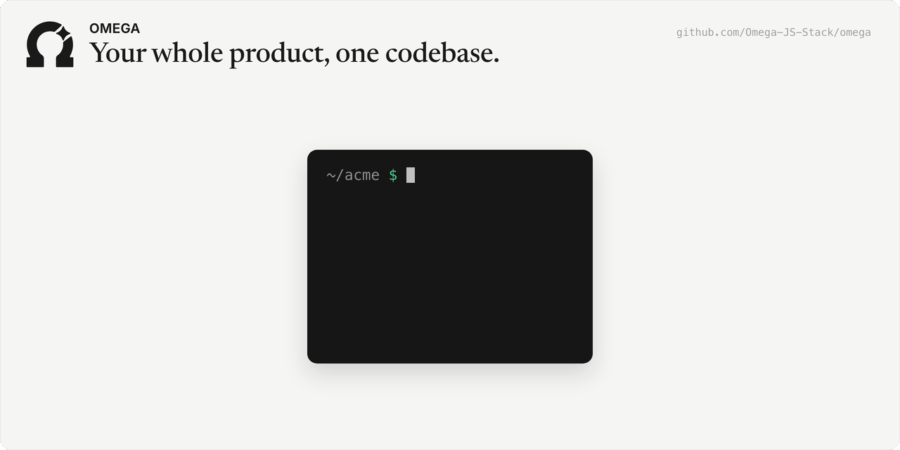

<p align="center">
  
</p>

<h1 align="center"> OMEGA</h1>

<p align="center">One framework with auth, database, payments, email, analytics &amp; more already wired for your website, backend, desktop app &amp; browser extension.</p>

<p align="center">
  <a href="https://github.com/Omega-JS-Stack/brand-template/generate">
    
  </a>
</p>

## Get started

OMEGA calls your project a **brand**: one name, one look, and every app that carries them. You need Node 22 or newer and a GitHub account.

1. Click **Use this template** above. Name your new repo `<your-brand>-omega`, for example `acme-omega`.
2. Clone it and step inside:
   ```bash
   git clone https://github.com/<you>/acme-omega.git && cd acme-omega
   ```
3. Start it:
   ```bash
   npm start
   ```

npm installs OMEGA, then a short wizard asks about your brand: its name, web address, tagline and a few more. Every question has a default, so you can press Enter through it. OMEGA writes your project, installs it, and boots your website. The terminal prints the local address; open it in your browser and your site is there.

**What to do next**

- Add a backend: `npx omega onboard --targets=web,backend`. The desktop app and the browser extension work the same way.
- Set up your cloud services when you are ready: `npm run manage`.
- Using Claude Code with the omega plugin? Run the `omega:init` skill in an empty folder instead. It asks what you are building, creates the repo from the template, and ends on the same running site.

## Features

- **One project, every app**: your website, backend, desktop app and browser extension live side by side in one repo, set up by one file, `config/omega.json5`.
- **Accounts and data built in**: sign-in, user accounts and a Firestore database through Firebase, shared by every app.
- **Payments**: subscriptions and one-time purchases through Stripe, PayPal, Chargebee or Coinbase Commerce.
- **Email and marketing**: transactional email and scheduled campaigns sent through SendGrid, and newsletters through Beehiiv.
- **Analytics and error reports**: one list of events sent to GA4, Meta and TikTok, and errors reported to Sentry.
- **Translation**: AI translates your site, and the results are cached in your repo so nothing is translated twice.
- **Deploys you choose**: `npx omega deploy` publishes your apps. A commit never does.

## Documentation

- [The map](docs/omega.md): every package, every guide, and how they fit.
- [Working in your brand](docs/manager/brand.md): the folders, the commands, and the rules.
- [The config file](docs/shared/config.md): every setting in `config/omega.json5`.
- [The website](docs/web/index.md) and [the backend](docs/backend/index.md): the two apps most brands start with.
- [Deploys](docs/shared/deploys.md): how your apps go live.

Coding agents start at [AGENTS.md](AGENTS.md), which loads the same map.

## Packages

| Package | What it does |
|---|---|
| [`@omega.js/manager`](https://www.npmjs.com/package/@omega.js/manager) | Creates and runs your brand: the wizard, the `omega` command, cloud setup and deploys |
| [`@omega.js/web`](https://www.npmjs.com/package/@omega.js/web) | Builds your website, with themes, sections and translation |
| [`@omega.js/backend`](https://www.npmjs.com/package/@omega.js/backend) | Builds your backend on Firebase Cloud Functions: accounts, payments, email |
| [`@omega.js/desktop`](https://www.npmjs.com/package/@omega.js/desktop) | Builds your desktop app with Electron for macOS, Windows and Linux |
| [`@omega.js/extension`](https://www.npmjs.com/package/@omega.js/extension) | Builds your browser extension for Chrome, Firefox and more |
| [`@omega.js/client`](https://www.npmjs.com/package/@omega.js/client) | The code your website, desktop app and extension share in the browser: sign-in, data, error tracking |
| [`@omega.js/mcp-router`](https://www.npmjs.com/package/@omega.js/mcp-router) | Gives coding agents one tool connection to your browser, app and extension |

## Contributing

Want to work on OMEGA itself? Start with [CONTRIBUTING.md](CONTRIBUTING.md).

## License

OMEGA is source-available under the [Elastic License 2.0](LICENSE). You may use and change it freely; a license key unlocks payments in production deploys and removes the attribution (local development and test payments are always free), and you may not offer it to others as a hosted or managed service.
